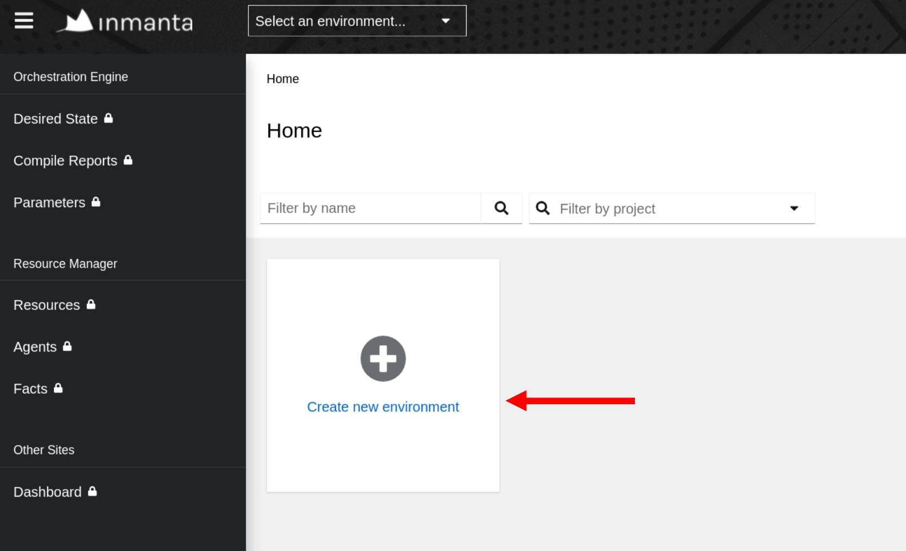
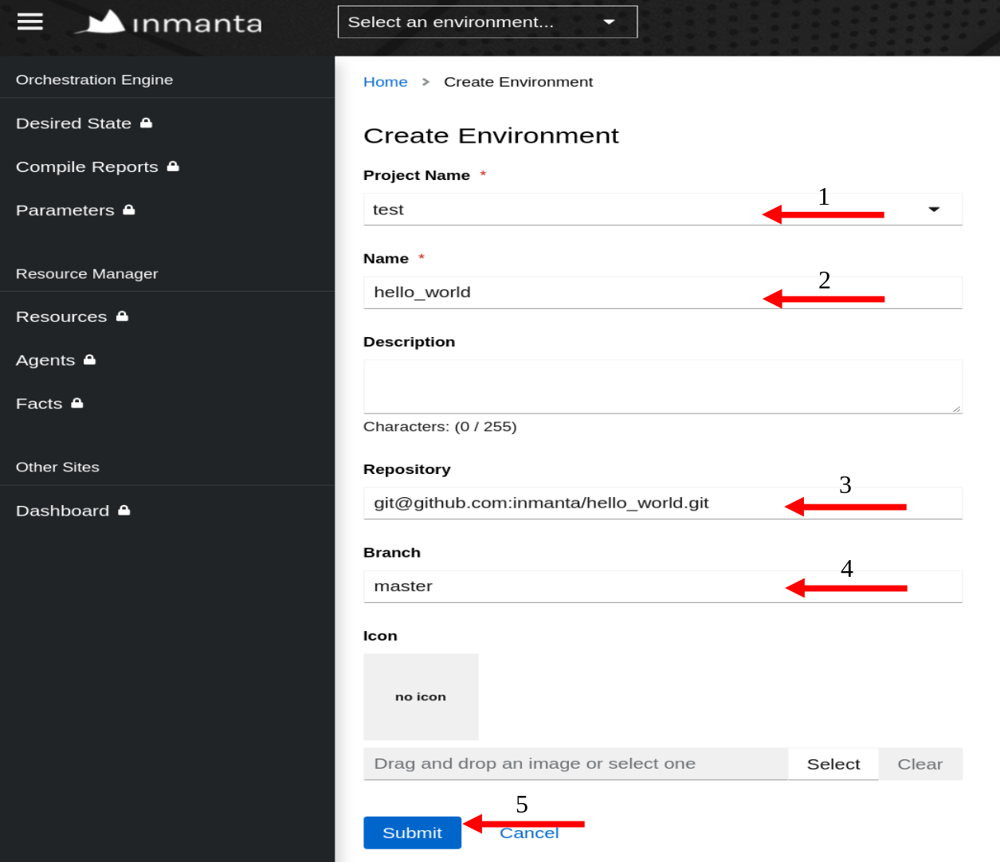
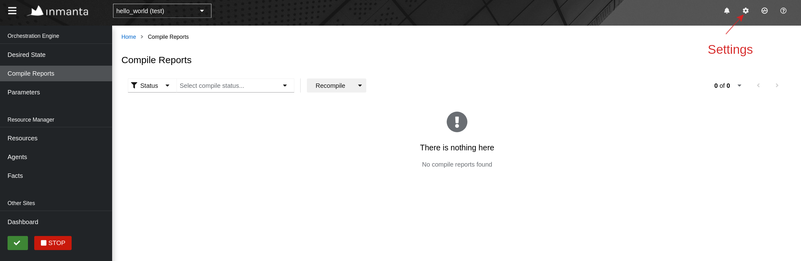
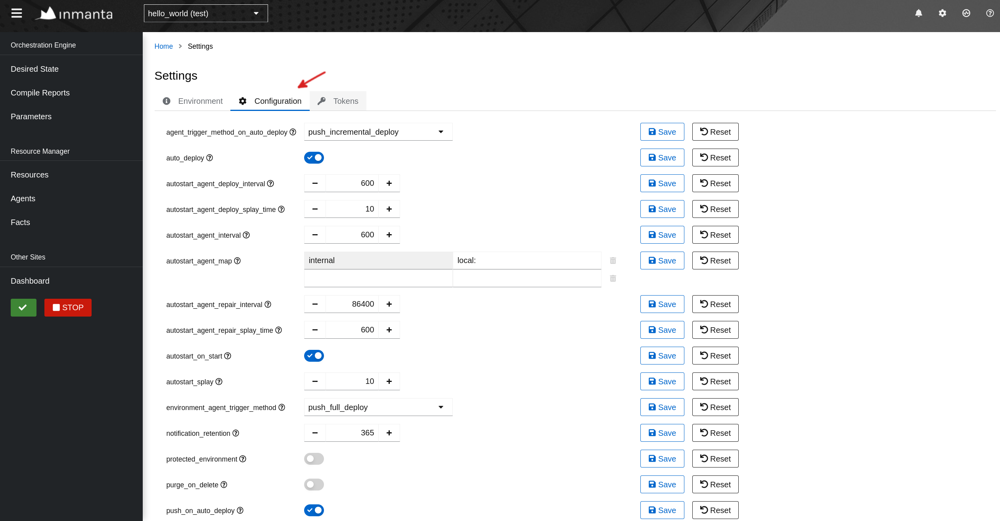
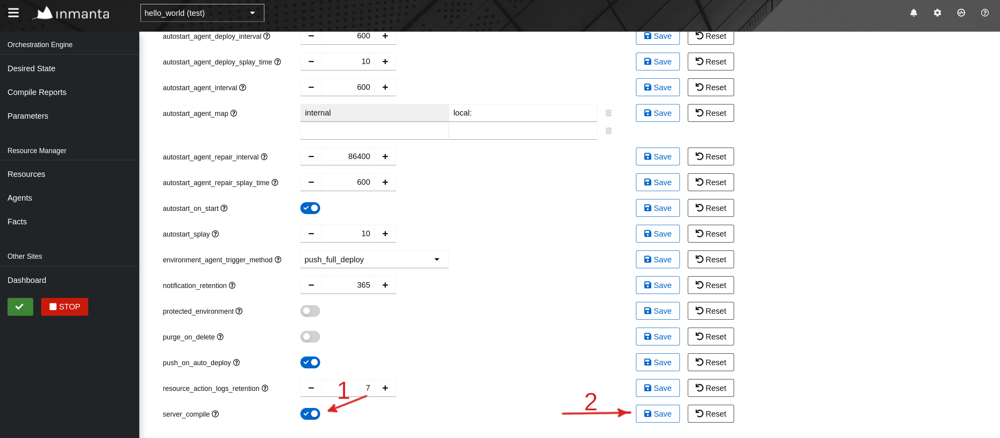
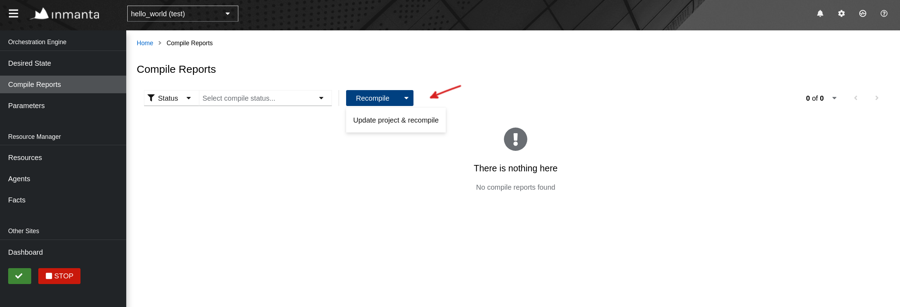

# Hello world

This is a simple example project to test if your orchestrator is installed correctly.

For instruction on installing the inmanta orchestrator go [here](https://docs.inmanta.com/community/latest/install.html).

## Using this repo

This model installs a file on the orchestrator machine itself in `/tmp/inmanta_hello_world` as the `inmanta` user.

The project can be installed using two ways; CLI and Web Console.

* To install from the `CLI`, on the orchestrator:

    ```bash
    inmanta-cli project create --name test
    inmanta-cli environment create --name hello_world --project test --repo-url git@github.com:inmanta/hello_world.git
    ```

    Then go to the `Web Console` and click 'Update and Recompile'

* To install from the `Web Console`, on the orchestrator:

    Head to the Web Console and click on `Create new environment`:

    

    Fill in the information:

    

    Go to settings:

    

    Click on `Configuration` and go to the bottom of the page:

    

    Enable `server_compile` and click on `save`:

    

    Click on the `Recompile` arrow then select `Update project and recompile`:

    
